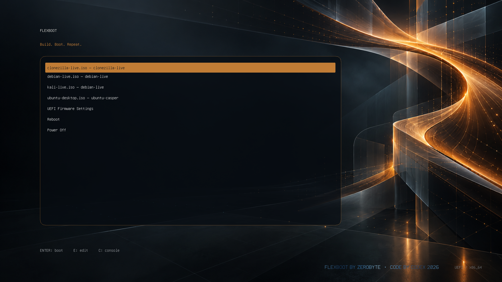

<p align="center">
  
</p>

<h1 align="center">FlexBoot</h1>

<p align="center"><strong>Build. Boot. Repeat.</strong></p>

<p align="center">
  Create polished, auditable GRUB multiboot USB drives from ordinary Linux ISO files.
</p>



Actual GRUB screen captured in QEMU/OVMF at 1920×1080, with example ISO entries.

FlexBoot is a small Linux command-line tool for building and maintaining UEFI multiboot media. ISO images remain intact as normal files, GRUB configuration stays readable, and every boot entry comes from an explicit profile that inspects the image contents.

FlexBoot uses standard Linux utilities and the GNU GRUB supplied by the host distribution. Runtime operations do not download bootloaders, themes, scripts, or ISO images.

**Development status:** There are unresolved safety bugs in mount cleanup, existing-image creation, and multi-disk ancestry protection. See [known safety issues](docs/SECURITY.md#known-safety-issues) before using writable operations; this version is published for development and is not recommended for production use.

## Highlights

- Strong wrong-disk protection, including system-disk detection and identity revalidation.
- GPT media with a dedicated FAT32 EFI partition and ext4 ISO storage.
- Intact ISO files under `/iso`; adding an image does not rebuild the drive.
- Explicit profiles for Ubuntu, Debian/Kali Live, SystemRescue, Arch, Rescuezilla, Clonezilla, and Fedora Live.
- Transactional ISO copies, SHA-256 integrity records, and generated-menu verification.
- Two selectable GRUB layouts and four original wallpapers, plus custom PNG support.
- Raw-image creation for safer development and optional QEMU/OVMF testing.
- Python standard library implementation with no mandatory third-party Python packages.

The intended workflow is:

```bash
flexboot devices
sudo flexboot create /dev/sdX
sudo flexboot add /dev/sdX ubuntu.iso clonezilla.iso fedora.iso
sudo flexboot status /dev/sdX
sudo flexboot theme /dev/sdX quantum-fold
sudo flexboot verify /dev/sdX
```

When running directly from a checkout, replace `flexboot` with `python3 -m flexboot` and use `sudo python3 -m flexboot` for privileged commands.

## Supported environment

- Linux host on x86-64
- UEFI firmware
- Secure Boot disabled
- GPT target disk
- Python 3.11 or later
- Host-provided GNU GRUB x86-64 EFI modules

### ISO families

| Family | Detection and boot method | Current validation |
|---|---|---|
| Ubuntu desktop/live | Casper kernel, initrd, and live filesystem; `iso-scan/filename=` | Profile tests |
| Ubuntu Server | Current casper server layout and server loopback arguments | Real ISO and hardware boot |
| Debian Live / Kali Live | Debian live filesystem; `findiso=` | Profile tests |
| SystemRescue | Product layout and vendor `loopback.cfg` | Profile tests; hardware pending |
| Arch Linux | Archiso layout and vendor `loopback.cfg` | Profile tests; hardware pending |
| Rescuezilla | Product marker plus casper resources | Publisher hash and real-image inspection; hardware pending |
| Clonezilla Live | Product marker plus Debian Live resources | Publisher hash and real-image inspection; hardware pending |
| Fedora Live | LiveOS, volume label, and dracut loader resources | Publisher hash and Fedora 44 inspection; hardware pending |

FlexBoot rejects incomplete and unknown layouts instead of producing speculative menu entries. Installer-only Kali images and Fedora network installers do not match the live profiles.

See [ISO profiles](docs/ISO-PROFILES.md) for the exact rules and extension interface.

## Dependencies

Run the built-in diagnostic first:

```bash
python3 -m flexboot doctor
```

On Debian or Ubuntu, the usual packages are:

```bash
sudo apt install \
  python3 fdisk dosfstools e2fsprogs util-linux \
  grub-efi-amd64-bin grub-common xorriso
```

FlexBoot checks for `lsblk`, `findmnt`, `sfdisk`, `wipefs`, `mkfs.fat`, `mkfs.ext4`, `losetup`, `mount`, and `grub-install`. ISO inspection prefers `xorriso` or `isoinfo` and includes a bounded read-only ISO 9660/Joliet reader when neither command is installed.

## Installation

### Run from a checkout

```bash
git clone https://github.com/zerobyte-99/FlexBoot.git
cd FlexBoot
python3 -m flexboot --help
python3 -m flexboot doctor
```

### Install locally

```bash
python3 -m pip install .
flexboot --help
```

The checkout remains directly runnable, so pip is optional.

## Safe quick start

### 1. Discover the USB drive

```bash
python3 -m flexboot devices --verbose
python3 -m flexboot wizard
```

Review the path, model, capacity, serial, transport, partitions, filesystems, mountpoints, and stable identity. USB transport marks a device as a candidate; all safety checks still apply.

### 2. Preview the operation

```bash
sudo python3 -m flexboot create /dev/sdX --dry-run
```

Dry-run mode performs no persistent modifications.

### 3. Create the drive

```bash
sudo python3 -m flexboot create /dev/sdX
```

Interactive creation requires typing the complete phrase exactly:

```text
ERASE /dev/sdX
```

For unattended creation, bind the request to the expected device identity:

```bash
sudo python3 -m flexboot create /dev/sdX \
  --confirm-erase \
  --expect-identity /dev/disk/by-id/usb-EXACT_ID
```

Mounted targets, partition nodes, read-only disks, undersized disks, and storage backing `/`, `/boot`, `/boot/efi`, or swap are rejected. Non-USB physical disks require `--allow-non-usb` in addition to every other safeguard.

### 4. Add ISO files

```bash
sudo python3 -m flexboot add /dev/sdX \
  ubuntu-26.04-live-server-amd64.iso \
  clonezilla-live-amd64.iso \
  Fedora-Workstation-Live-x86_64.iso
```

Preview image detection without copying:

```bash
python3 -m flexboot add /dev/sdX *.iso --dry-run
```

For each supported image, FlexBoot calculates SHA-256 while copying to a temporary destination, flushes it, atomically renames it, updates the manifest, regenerates the menu, and validates the GRUB syntax. The recorded hash checks later local integrity; compare downloads with vendor-published hashes or signatures to establish source authenticity.

### 5. Inspect and verify

```bash
sudo python3 -m flexboot list /dev/sdX
sudo python3 -m flexboot status /dev/sdX
sudo python3 -m flexboot inspect /dev/sdX --json
sudo python3 -m flexboot verify /dev/sdX
```

## Media management

```bash
# Add more images
sudo python3 -m flexboot add /dev/sdX another.iso

# Remove one image and its menu entry
sudo python3 -m flexboot remove /dev/sdX old.iso

# Reinspect files and regenerate metadata, GRUB, and theme assets
sudo python3 -m flexboot sync /dev/sdX
```

`sync` stops if an unsupported ISO is present. Unsupported files never receive guessed boot entries.

## Themes and wallpapers

FlexBoot stores the layout and background independently on each drive. Switching one preserves the other.

List the available choices:

```bash
python3 -m flexboot theme --list
```

### Layout themes

```bash
# Branded glass panel, title, tagline, footer, and credits
sudo python3 -m flexboot theme /dev/sdX flexboot

# Centered frameless layout based on Kali's published GRUB geometry
sudo python3 -m flexboot theme /dev/sdX kali
```

### Included wallpapers

<table>
  <tr>
    <td width="50%"></td>
    <td width="50%"></td>
  </tr>
  <tr>
    <td align="center"><strong>1 — Classic Grid</strong></td>
    <td align="center"><strong>2 — Ember Circuit</strong></td>
  </tr>
  <tr>
    <td width="50%"></td>
    <td width="50%"></td>
  </tr>
  <tr>
    <td align="center"><strong>3 — Orbital Lattice</strong></td>
    <td align="center"><strong>4 — Quantum Fold</strong></td>
  </tr>
</table>

Select a background by number or name:

```bash
sudo python3 -m flexboot theme /dev/sdX 4
sudo python3 -m flexboot theme /dev/sdX orbital-lattice
```

Use a custom background:

```bash
python3 -m flexboot theme /dev/sdX ~/Pictures/custom.png --dry-run
sudo python3 -m flexboot theme /dev/sdX ~/Pictures/custom.png
```

Custom backgrounds must be non-interlaced RGB, RGBA, or grayscale PNG files no larger than 8192×8192 pixels or 50 MiB. FlexBoot copies the image to `.flexboot/theme-background.png`; later `sync` operations preserve it.

Brand name, tagline, filesystem labels, credit text, gradient, font, and default wallpaper are centralized in [`flexboot/assets/branding.conf`](flexboot/assets/branding.conf). Run `python3 tools/generate_credit_asset.py` after changing the credit settings. See the [brand guide](branding/BRAND.md).

## Disk layout

FlexBoot creates exactly two GPT partitions:

```text
USB drive
├── Partition 1: 512 MiB FAT32, FLEXBOOTEFI
│   ├── EFI/BOOT/BOOTX64.EFI
│   └── boot/grub/
│       ├── grub.cfg
│       ├── generated.cfg
│       ├── fonts/
│       └── themes/flexboot/
└── Partition 2: remaining space, ext4, FLEXBOOT
    ├── iso/
    └── .flexboot/
        ├── manifest.json
        ├── theme.json
        ├── install.json
        └── version
```

The FAT32 partition contains only the removable UEFI loader and presentation files. ISO images live on ext4, avoiding FAT32's single-file size limit. GRUB locates the data filesystem by UUID and never relies on `(hd0)` or Linux `/dev/sdX` ordering.

## Raw images and QEMU

The raw-image path uses the same partitioning, formatting, GRUB, theme, and media code as physical targets:

```bash
sudo python3 -m flexboot image create ./out/flexboot.img --size 8G
sudo python3 -m flexboot image inspect ./out/flexboot.img
python3 -m flexboot image boot ./out/flexboot.img
```

The boot command uses software emulation and common OVMF locations. Missing QEMU or OVMF support is reported clearly and does not affect physical-media use.

## Security model

The primary failure FlexBoot prevents is formatting the wrong disk. Before destructive physical-device operations it:

1. requires a whole block disk;
2. resolves symlinks and records major/minor, capacity, transport, model, serial, and stable identity;
3. discovers storage backing `/`, `/boot`, `/boot/efi`, device-mapper layers, and swap;
4. rejects the system disk and mounted children;
5. prefers USB transport and requires an override for other physical disks;
6. requires a typed erase phrase for interactive creation;
7. requires confirmation plus an expected identity for unattended creation;
8. revalidates device identity immediately before writing the partition table.

All subprocesses use argument arrays with `shell=False`. FlexBoot does not collect telemetry or contact the Internet during normal operation.

Read the complete [security model](docs/SECURITY.md) before changing device-selection or partitioning code.

## Development and testing

Run the standard test suite:

```bash
python3 -m unittest discover -v
python3 -m compileall -q flexboot tests tools
```

The default suite uses synthetic device and ISO fixtures and never writes physical media. The privileged image integration test is opt-in:

```bash
sudo FLEXBOOT_RUN_IMAGE_TESTS=1 \
  python3 -m unittest tests.test_integration_image -v
```

See [development](docs/DEVELOPMENT.md) for the test workflow and host-dependent integration requirements.

## Documentation

| Document | Contents |
|---|---|
| [Architecture](docs/ARCHITECTURE.md) | Components, boundaries, and data flow |
| [Security](docs/SECURITY.md) | Wrong-disk protections and threat model |
| [ISO profiles](docs/ISO-PROFILES.md) | Supported layouts and profile development |
| [Windows and other systems](docs/WINDOWS.md) | Boot requirements and extension options; Windows is not yet supported |
| [Development](docs/DEVELOPMENT.md) | Local workflow and integration tests |
| [Troubleshooting](docs/TROUBLESHOOTING.md) | Common dependency, ISO, GRUB, and theme issues |
| [Research](docs/RESEARCH.md) | Primary technical references |

## Current limitations

- UEFI x86-64 only
- Secure Boot unsupported
- Legacy BIOS unsupported
- ARM64 unsupported
- Windows installer ISOs unsupported
- Persistence overlays unsupported
- Encrypted ISO storage unsupported
- Custom profile definitions unsupported

The roadmap includes persistence for compatible distributions, richer theme controls, Secure Boot design, legacy BIOS, ARM64 UEFI, Windows installer support, and an optional desktop frontend. New boot families are added only when their boot mechanism can be documented and validated reliably.

## Project principles

- Standard Linux tooling
- Host-provided GNU GRUB
- Readable configuration and metadata
- No downloaded runtime components
- Conservative image detection
- Fail-closed device safety
- Small, auditable implementation

FlexBoot is an independent project and does not include or depend on Ventoy.

## License

FlexBoot is released under the [GNU General Public License v3.0 or later](LICENSE).
