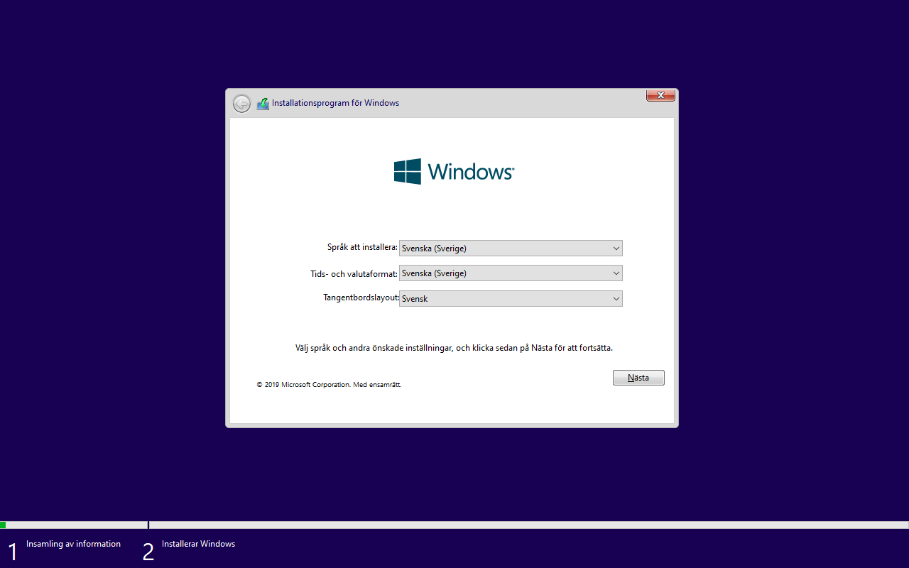
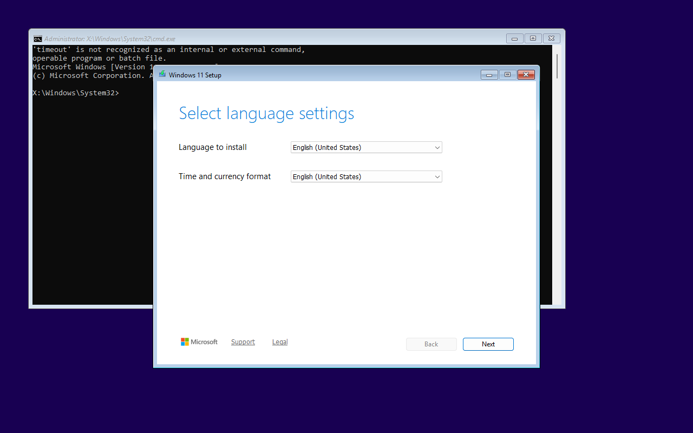

# Windows loader experiments — 2026-10-09

**Selected direction: an optional NTloader handoff plus Windows' native ISO
mounting API, with small FlexBoot-owned preparation and source-selection code.**
This is a successful lab prototype, not Windows support in the FlexBoot CLI.

## Media and isolation

The user supplied two existing x86-64 installer ISOs: Windows 10 22H2 Swedish
and a Windows 11 English image. Their boot environments identify themselves as
10.0.19041.2728 and 10.0.26100.9457 respectively. The Windows 11 source filename
included a different build number; filenames were not treated as version proof.
Publisher authenticity was not verified in this experiment.

Both intact ISOs and their extracted trees were staged together on a private
NTFS raw image. The original ISOs were only read. A separate FAT32/GPT boot
image held each test's GRUB, loader and matching WinPE resources. QEMU/OVMF
received only these images and fresh evidence storage; it had no guest NIC,
physical disks or installation target. The remotely staged data image was
exported read-only over an SSH tunnel; guest writes used disposable snapshots.
No existing VM configuration or physical partition table was changed.

Attempts used private firmware state, fresh evidence disks, screenshots and
WinPE logs. Initial fixture failures were excluded: a BIOS BCD store mistakenly
used for native UEFI boot, stale evidence reused on reruns, and attempted COM1
logging that stock WinPE rejected. Corrected runs are the evidence below.

## Results

| Candidate | Verified result | Decision |
|---|---|---|
| Native Microsoft EFI loader, extracted files | Windows 10 WinPE, selected WIM enumerated by DISM, Setup language screen | Working baseline; does not solve single-menu selection among arbitrary BCD stores |
| NTloader + native ISO API | Windows 10 **and** Windows 11 WinPE; intact selected ISO mounted read-only; DISM enumerated the matching WIM; Setup language screens | Preferred optional Windows backend |
| NTloader + ImDisk | Windows 11 ISO mounted read-only, selected WIM enumerated by DISM, Setup language screen | Working alternative; unnecessary driver for the tested media |
| iPXE wimboot through stock GRUB `linux`/`initrd` | Windows 10 test reset before WinPE, including retry with UEFI BCD | This handoff is not validated; not evidence that iPXE's documented network flow fails |
| GRUB2 File Manager's Windows path | Source-built fork loaded Windows 11 WinPE and reached Setup language selection from the ISO | Functional boot candidate, but no independent DISM/source-selection check; custom GRUB and broader runtime unsuitable as first choice |

NTloader tests used stock host GRUB 2.14. Software-emulated boot demonstrated
Windows 11 WinPE/ISO access; subsequent KVM runs completed the Windows 10 and 11
Setup checks. This does not establish compatibility with older GRUB releases.

Windows 10's selected ISO exposed a 4,940,041,937-byte WIM containing ten editions;
Windows 11's exposed an 8,155,984,950-byte WIM containing eleven. Both were present
on the same NTFS test volume. Startup selected the requested ISO by an explicit
image identifier, discovered the source drive using a marker, rejected anything
other than one matching source volume, and validated its WIM before launching
that ISO's Setup with an explicit `/InstallFrom` argument.

A negative Windows 11 run requested a deliberately absent ISO while both valid
ISOs remained available. The native API returned file-not-found (`2`), startup
recorded `ISO_MOUNT_FAILED`, and neither payload validation nor Setup launch
occurred. This tests missing-file rejection, not every source-identity failure.

The successful Windows 10 invocation used `/InstallFrom:"<path>"`; a space-form
attempt was rejected by that supplied installer. Windows 11 accepted the
space form documented in Microsoft's [Setup reference](https://learn.microsoft.com/en-us/windows-hardware/manufacture/desktop/windows-setup-command-line-options?view=windows-11#installfrom).
This difference needs deliberate compatibility handling rather than one
unchecked command-line template.

These are real QEMU captures. The background command window in the Windows 11
capture belongs to the lab startup script. Missing optional `timeout`/`tasklist`
commands in stock WinPE did not prevent the DISM or Setup checks; those commands
must not become runtime dependencies.

## Why the native API is preferred

The independent [NTloader project](https://github.com/grub4dos/ntloader) provides
the WIM boot bridge. A prepared copy of the chosen ISO's boot WIM launches a
small helper calling Microsoft's
[OpenVirtualDisk](https://learn.microsoft.com/en-us/windows/win32/api/virtdisk/nf-virtdisk-openvirtualdisk)
and [AttachVirtualDisk](https://learn.microsoft.com/en-us/windows/win32/api/virtdisk/nf-virtdisk-attachvirtualdisk)
with read-only ISO attachment. Stock WinPE from both tested images supplied the
required API and driver; PowerShell was unnecessary.

The API probe source is [tools/windows/native_mount.c](../tools/windows/native_mount.c).
It is experimental and is neither installed nor invoked by FlexBoot. It loads
`virtdisk.dll` from the system directory, reports failures, and rejects multiple
new CD-ROM letters. The attachment persists until the disposable guest shuts
down. A production implementation must identify the attached device directly,
verify its association with the requested ISO, and implement explicit detach;
new-drive enumeration alone is insufficient under concurrent attachment.

[ImDisk](https://github.com/LTRData/ImDisk) also succeeded. Stock WinPE lacked
`sc.exe`, so an isolated helper used the Windows service API to start its signed
driver. No driver was installed on either Linux host. The native API avoids
shipping and maintaining that extra driver for the tested Windows versions.

[iPXE wimboot](https://ipxe.org/wimboot) remains a credible WIM loader, but the
local stock-GRUB handoff tested here failed. Its documented iPXE flow was not
exercised. [GRUB2 File Manager](https://github.com/a1ive/grub2-filemanager) required
its own GRUB fork; its original startup scans drive letters for Setup sources
without the explicit WIM selection used above. A boot screen does not establish
safe multi-image selection for that path.

## Reproducibility and dependencies

Source revisions used in the private lab:

- NTloader: `744a6108d32ea47df95e9fd1ab42884525685985` (v3.0.7), x86-64 source build.
- iPXE wimboot: `cd3e0210486f922e9828c50c29598a1cbfde0378` (v2.9.0), x86-64 source build.
- GRUB2 File Manager: `918524dc18f08eba1ade421282b54a7b2787fa15`.
- Its GRUB fork: `77322411ddd574b461ca7c2b666c881bae51d8bd`, x86-64 EFI source build.
- ImDisk: official signed 2.1.2 package, archive SHA-256
  `d42059314384992b5e7754a5734e66e7ad0ad7971f69a2b5aa106429b47c4a9c`.

Microsoft EFI/SDI/WIM files came from the selected user's ISO, including the EFI
loader supplied to the GRUB2 File Manager test. No Microsoft boot files, Windows
ISOs, downloaded runtimes, credentials or host-specific test configuration ship
in this repository. No Ventoy component was used. The public API probe can be
cross-compiled with an optional x86-64 MinGW-w64 C compiler; binaries stay outside
the repository. It is a capability probe, not a general ISO-mounting product.

To repeat the experiment, use disposable GPT/FAT32 boot and NTFS data images,
matching ISO boot resources, and a prepared boot-index-2 WIM with `winpeshl.ini`
startup. Use NTloader's documented stock-GRUB menu handoff, supplying the boot
volume UUID and the selected WIM path. In WinPE, initialize devices, uniquely
identify the data volume, attach only the selected ISO, validate its WIM with
DISM, then start its root Setup executable with explicit WIM selection. Preserve
fresh logs and an actual ready Setup screen for each attempt. Never expose
physical disks to the guest.

## Boundaries and next implementation

No full Windows installation, reboot into installed Windows, physical USB,
Secure Boot, BIOS, ARM64, Server ISO, ESD or split-WIM installation was verified.
The two images shared a data volume, but a single multi-entry GRUB menu and an
actual combined USB layout still need integration tests. These image fixtures
are not a test of FlexBoot's production partition builder.

A production Windows backend would therefore require:

1. Explicit opt-in Windows-readable storage, without resizing an existing drive.
   The current ext4 data partition is unsuitable for stock WinPE, and these
   intact ISOs exceed FAT32's per-file limit.
2. An explicit user-provided/audited NTloader runtime, validated against its
   provenance and supported host-GRUB handoff. No automatic runtime download.
3. Per-image boot-WIM preparation using matching ISO resources, staged metadata
   and removal/verification support. Never modify the source ISO.
4. Deterministic selection, exact mounted-source identity checks, missing or
   ambiguous media rejection, cleanup and representative hardware validation.
5. A two-entry GRUB regression test and installation onto a separate disposable
   virtual target, including failure cases, before advertising Windows support.

Reuse the existing loader and Windows API; build the small preparation and
selection layer ourselves. A new Windows bootloader or virtual-disk driver is
not justified by these results.
